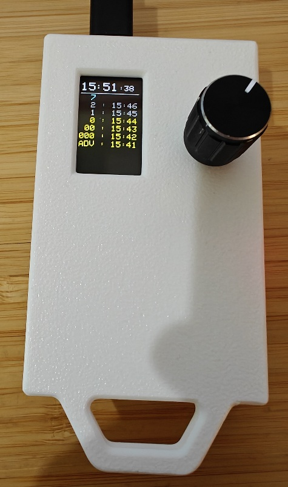
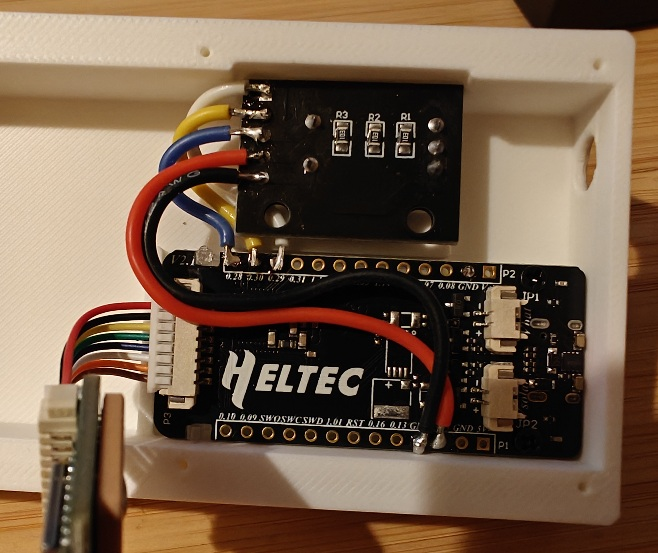

# A heltec t114-based sequence and time tracker for rally usage
## This is super prototype code, it seems to work but I make no guarantees.

## User Guide

The clicker display has two sections: a gps-synced real-time clock at the top and a log of button clicks below.

As is traditional with rally, the number seqence starts with the advance car, then 000, 00, and 0 before reaching sequence number 1. The teal number at the top of the log is the *next* sequence number, clicking will commit it and the current time to the log

When the clicker starts, the clock will be all red Xes and the knob will do nothing- this is normal while waiting for GPS.

Once GPS time is synced, the clock will update to real time (in the configured time zone), and the knob will begin to function:

**Clicking the knob** will record an entry to the log

**Twisting the knob** will scroll up or down the log. Clicking while scrolled down will still record to the top of the log, and scroll back up to the top - no need to worry about messing up the order

**Long-pressing the knob** will enter number-selection mode. The blue *next* number will blink

**While in number-selection-mode** twisting the knob will adjust the *next* number. Clicking or long-pressing the knob will return to log mode but not log an entry.

**Long-pressing the menu button** will enter the menu, for time zone adjustment

**Pressing the menu button again** will exit the menu

**The knob** will navigate and manipulate the menu. Click on an entry to adjust it, click again to back out to navigation.

*Note that this library currently only stores the log in memory - turning it off and then on again wil loose the current log!*

## Hardware needed
- Heltec T114
- Heltec GPS module (for time sync)
- Battery
  - 30mm x 40mm x 8mm
  - 1000mah
- Rotary encoder with click-button (for human input)
  - I used a generic KY-040 dev board
- MTS-101 mini toggle switch

## Wiring diagram

## Pin assignments

- **0.29** Rotary encoder CLK pin
- **0.30** Rotary encoder DT pin
- **0.28** Rotary encoder SW pin
  - (Yes, the IO pins are in this order on the board for some reason)

- **V3.3** Rotary encoder + pin
  - Might also work from Ve3.3, but haven't tried
- **G** Rotary encoder ground pin

## Software process

RallyClicker is a PlatformIO project, developed in VS Code. That'll be by far the easiest way to build, run, and flash the project.

In traditional arduino fashion, everything is mashed into main.cpp.

SPI TFTs are slow and drawing to the screen blocks encoder I/O: minimizing redraws is important.

## Acknowledgements

This project would not exist without the open source community

Graphics, filesystem, and neopixel libraries from Adafruit
Radio library (unused but needed for board) by Jan Gromeš
TinyGPSPlus library by Mikal Hart
AdvancedRotaryEncoder lib by Paul Thomsen 
Time library by Paul Stoffregen
Regexp library by Nick Gammon
